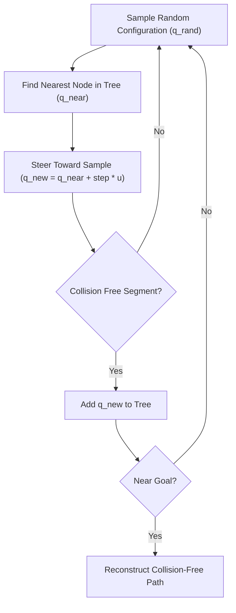

# Rapidly-exploring Random Tree (RRT) Motion Planner Skill

Sampling-based 2D motion planner for autonomous robots navigating cluttered obstacle fields.

## Features
- **100% Python Standard Library**: Pure mathematical geometric primitives.
- **Goal Biasing**: Accelerated convergence toward target configuration.
- **Continuous Collision Checking**: Segment interpolation against circular obstacle geometries.
